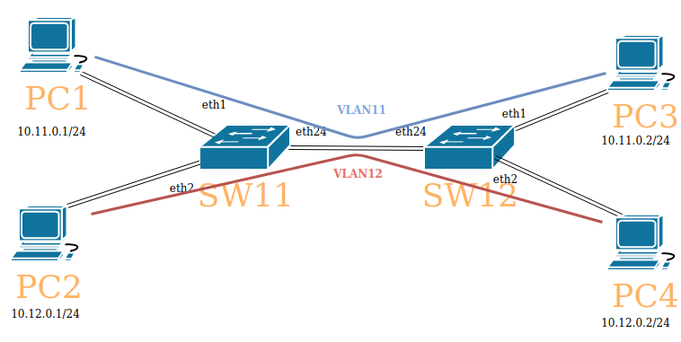

[Manual:Switch Chip Features](https://wiki.mikrotik.com/wiki/Manual:Switch_Chip_Features)

[Manual:CRS1xx/2xx series switches](https://wiki.mikrotik.com/wiki/Manual:CRS1xx/2xx_series_switches)

[Manual:CRS3xx series switches](https://wiki.mikrotik.com/wiki/Manual:CRS3xx_series_switches)

[MTU](https://wiki.mikrotik.com/wiki/Manual:Maximum_Transmission_Unit_on_RouterBoards)

[Optimising your MikroTik Layer2 configuration](https://mum.mikrotik.com/presentations/EU19/presentation_6567_1552377486.pdf)

[CRS328 as a Layer 2 Switch](https://mum.mikrotik.com/presentations/UK18/presentation_6174_1539088509.pdf)

[Мои топологии и описание лаб по CCNA](https://github.com/bubnovd/Labs)

## Lab Diagram

### Resolved
- [x] [effect of VLAN & QinQ on MTU](https://groups.geni.net/geni/wiki/QinqResults).

   В 802.1q EtherType 0x8100 и размер заголовка входит в Frame. При двух тегах Total Frame Size теперь 1500+18+4+4= 1526. MTU теперь 1500-4-4

   В 802.1ad EtherType Service тэга 0x8a88 и он не считается во фрейме. Total Frame Size = 1500+18+4+4= 1526. Теперь MTU 1500-0-4 

- [x] why NOT to add vlan interfaces as untagged ports in a bridge, for both regular traffic and management interface: [It will cause problems if also using STP/RSTP with other vendor’s switches because BPDUs are tagged](https://wiki.mikrotik.com/wiki/Manual:Layer2_misconfiguration#VLAN_on_a_bridge_in_a_bridge)
- [x] only 802.3ad and balance-xor are supported with HW-offloading
- 802.3ad is compatible with other vendors using LACP
- Balance-xor is compatible with other vendors static LAG.

### Labs
- [x]  1. Проверить работу QinQ с разными тегами. Обратить внимание на MTU, L2MTU. Проверить Wireshark'ом
- [x] 2. [InterVLAN Routing on CRS3xx](https://wiki.mikrotik.com/wiki/Manual:CRS_Router#InterVLAN_Routing_2)
- [x] 3. MAC(CRS)/Port/Protocol VLAN
4. Проверить QoS на CRS3xx: MAC, port, Protocol, DSCP, VLAN
- [x] 5. Tag stacking
- [x] 6. 3 ways of doing VLANs: Virtual VLAN interface (and bridging together), VLANs on switch menu, Bridge VLAN filtering
7. Ingress/Egress Filtering
- [x] 8. CRS Port isolation
9. Lab to show bridge split horizon in action
10. Local Proxy ARP (how 2 devices can now communicate with port isolation which they could not before)
- [x] 11. Management VLAN on switch
12. BPDU Guard + Wireshark
13. [Storm Control On CRS3xx](https://wiki.mikrotik.com/wiki/Manual:CRS3xx_series_switches#Traffic_Storm_Control)
14. Proxy ARP VS Local Proxy ARP
- [x] 15. Mirroring

### Facts
- [CRS3xx is designed to use the built-in switch chip to work with bridge VLAN filtering](https://wiki.mikrotik.com/wiki/Manual:CRS3xx_series_switches#VLAN_Filtering)
- On CRS3xx For ingress traffic QoS policer is used, for egress traffic QoS shaper is used.
- DHCP Snooping blocks ALL DHCP packets not just replies like some other vendors
- ARP Table Size /ip settings set max-neighbor-entries
- most RouterBOARDs only support 1 bridge with HW-offloading
- Bridge horizon feature allows to configure bridge ports with horizon setting so that packet received over port with horizon value X is not forwarded or flooded to any port with the same horizon value X
- split-horizon works in software and will disable hw-offloading
- The STP is not aware of the underlying port isolation configuration, so there are no separate spanning trees for each isolated network, but a single one for all isolated networks

### Узнать про
- [depending on the switch chip fitted to a RouterBOARD, some of the bridge features will disable HW-offloading](https://wiki.mikrotik.com/wiki/Manual:Interface/Bridge#Bridge_Hardware_Offloading)
- Explain how some of the features that are available in the switch menu and on the switch chip don’t work when bridge HW-offloading is disabled due to selecting those specific features.
- how to use frame-types setting with ingress filtering
- how ingress filtering works on bridge interface, this is not a global setting for bridge but for interface between switch and the CPU
- [802.1X](https://wiki.mikrotik.com/wiki/Manual:Interface/Dot1x)